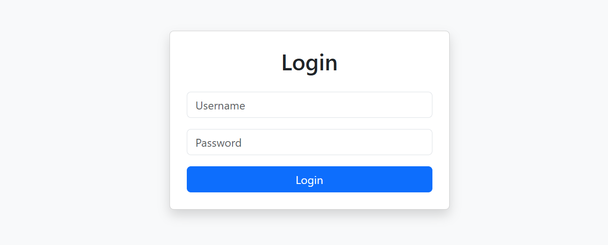
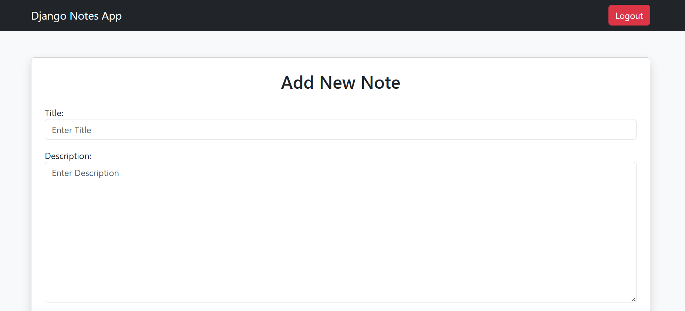

# Notes App

A Django Notes App with user authentication and note management features.

## Features

- User Registration
- Login / Logout
- Private Notes
- Search Notes
- Note Categories
- Note Timestamp
- Edit & Delete Notes
- Responsive UI using Bootstrap

## Technologies Used

- Python
- Django
- SQLite
- Bootstrap

## Installation Steps

1. Clone repository

```bash
git clone https://github.com/denish-makvana

## Screenshots

### Login Page



### Notes App

